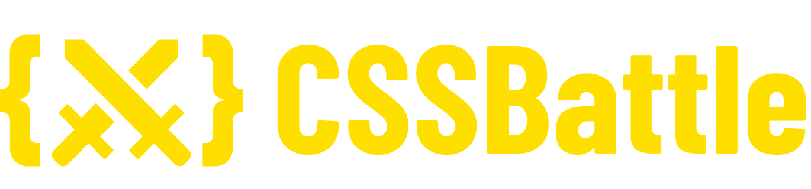

# CSSBattle Solutions

My solutions submitted to [CSSBattle](https://cssbattle.dev/) platform.

CSSBattle is an online CSS Code Golfing game.
> The objective of the game is to write HTML/CSS to replicate the given target image in the least code possible.

Based on studying CSS concepts, the solutions available in this repository focus on readability instead of brevity.

## MIT License

This project is available under the MIT License. Read the [LICENSE](LICENSE) file for more info.
